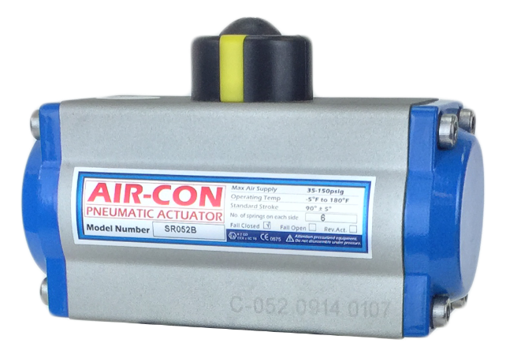

# AirCon C-Series Rack and Pinion Pneumatic Actuators

**Brand:** AirCon (Flo-Tite Valves & Controls)  
**Category:** Actuators / Pneumatic Actuators / Rack & Pinion Actuators  
**SKU:** AC-C-RPA  
**Status:** In Stock / Modulatable

---

## Short Description
The **AirCon C-Series Pneumatic Actuators** are engineered to deliver reliable, quarter-turn automation for industrial valves. Utilizing a rugged dual-opposed rack and pinion design, these actuators provide high-speed response, outstanding cycle life, and a linear torque output from 0° through 90° strokes. They are highly customizable with double-acting and spring-return configurations to meet any process safety requirement.

- **Torque Range:** 50 through 28,500 in-lbs (covering valve sizes 2" to 12").
- **Independent Travel Stop:** ±5° adjustment in both open and closed positions.
- **Standards Compliance:** Fully conforms to ISO 5211, DIN 3337, and NAMUR standards.
- **Heavy-Duty Casing:** Extruded aluminum body with standard hard anodized finish.

---

## Product Gallery

---

## Detailed Description

### Overview
AirCon Rack & Pinion Pneumatic Actuators offer a compact and cost-effective solution for automating ball, butterfly, and plug valves. The C-Series features a sleek, modular design where double-acting units can be easily converted to spring-return (fail-safe) by adding pre-loaded spring cartridges.

### Design Advantages
- **Extruded Aluminum Body:** Hard anodized finish on both internal and external surfaces prevents corrosion and minimizes wear on moving parts.
- **High-Precision Pinion:** Nickel alloy steel blow-out proof pinion provides robust power transmission and corrosion resistance.
- **Dual Opposed Pistons:** Opposed rack pistons utilize low-friction bearings and guides to ensure balanced forces, fast response times, and maximum cycle life.
- **Easy Maintenance:** Pistons can be easily inverted to reverse the direction of rotation (clockwise to counter-clockwise).

### Safety Features
- **Pre-Loaded Spring Cartridges:** Safe, modular cartridges prevent accidental spring ejection during disassembly.
- **Blow-Out Proof Pinion:** Designed to ensure the pinion remains safely housed even under extreme pressure conditions.

---

## Key Features & Benefits
*   **Linear Torque Output:** Delivers smooth, consistent torque across the entire quarter-turn rotation.
*   **NAMUR Solenoid Interface:** Allows direct mounting of solenoid valves without additional brackets.
*   **Universal Accessory Mounting:** Top indicator features standard NAMUR slots for easy limit switch box and positioner integration.
*   **Corrosion Protection:** Standard stainless steel 304 fasteners, polyester-painted end caps, and optional special body coatings for corrosive environments.

---

## Technical Specifications

### General Specifications
*   **Operating Pressure:** 40 to 120 psi (2.7 to 8.3 bar)
*   **Maximum Pressure:** 150 psi (10 bar)
*   **Rotation:** 90° (with ±5° travel adjustment at both ends)
*   **Operating Temperature:** 
    *   *Standard:* -20°F to 180°F (-29°C to 82°C)
    *   *Low Temp (Silicone O-rings):* -40°F to 180°F (-40°C to 82°C)
    *   *High Temp (Viton O-rings):* 0°F to 300°F (-18°C to 149°C)
*   **Lubrication:** Factory lubricated for life under normal operating conditions.

### Sub-Product & Model Performance Table
The AirCon C-Series consists of multiple model sizes (ranging from size 52/53 up to 270+) to cover different torque demands. Below is the technical torque data for standard sizes at common supply pressures:

| Actuator Model Size | Configuration | Torque @ 40 psi (in-lbs) | Torque @ 80 psi (in-lbs) | Torque @ 100 psi (in-lbs) | Spring End Torque (in-lbs) * |
| :--- | :--- | :--- | :--- | :--- | :--- |
| **AC-52 / AC-53** | Double Acting | 72 | 144 | 180 | N/A |
| **AC-52 / AC-53** | Spring Return (5-Springs)| N/A | 55 | 73 | 48 |
| **AC-63** | Double Acting | 134 | 268 | 335 | N/A |
| **AC-75** | Double Acting | 258 | 516 | 645 | N/A |
| **AC-83** | Double Acting | 382 | 764 | 955 | N/A |
| **AC-105** | Double Acting | 772 | 1544 | 1930 | N/A |
| **AC-125** | Double Acting | 1390 | 2780 | 3475 | N/A |
| **AC-160** | Double Acting | 2962 | 5924 | 7405 | N/A |
| **AC-210** | Double Acting | 6810 | 13620 | 17025 | N/A |
| **AC-270** | Double Acting | 14380 | 28760 | 35950 | N/A |

*\*Note: Spring End Torque represents the torque output at the end of the spring stroke for standard spring-return configurations. Torque figures can be customized by altering the quantity of spring cartridges.*

---

## Applications & Use Cases
*   **Ball & Butterfly Valve Automation:** Used extensively to automate valves from 2" to 12" sizes in process lines.
*   **Chemical & Process Industries:** Reliable operation of shut-off valves, bypass valves, and flow control loops.
*   **Water & Wastewater Treatment:** Automation of gate and butterfly valves in filtration and distribution.
*   **HVAC Systems:** Dampers and water control valve actuation.

---

## References & Sources
1.  **Local Source:** `AIRCON.docx` (Extracted Text: `AIRCON_extracted.txt`)
2.  **Manufacturer Catalog:** Flo-Tite AirCon Pneumatic Actuators Technical Bulletin
3.  **Official Site:** [Flo-Tite Valves & Controls](https://www.flotite.com)
