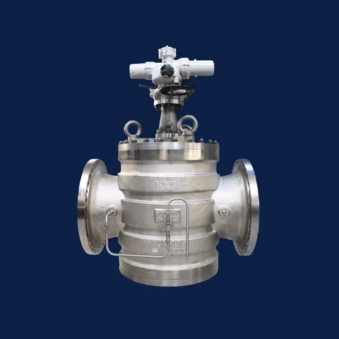

# Control Seal Rising Stem Ball Valves (RSBV)

**Brand:** Control Seal  
**Category:** Valves / High-Performance Valves / Rising Stem Ball Valves  
**SKU:** CS-RSBV-MTM  
**Status:** Build-to-Order / Request Quote

---

## Short Description
The **Control Seal Rising Stem Ball Valve (RSBV)** is a metal-to-metal seating valve designed for extreme operating conditions. Utilizing a unique tilt-and-turn stem mechanism, the valve pulls the ball away from the seat prior to rotation. This completely eliminates sliding friction, allowing the valve to operate reliably in high-temperature, cryogenic, abrasive, and high-frequency switching applications without seat wear or sticking.

- **Size Range:** 1" to 36" (DN 25 to DN 900)
- **Pressure Classes:** ASME 150# to 2500#
- **Temperature Range:** Extreme temperature capability from -196°C up to +538°C.
- **Sealing Design:** Single-seat, metal-to-metal mechanical sealing with zero leakage.

---

## Product Gallery

---

## Detailed Description

### Overview
In critical refining, petrochemical, and power generation processes, standard ball and gate valves fail prematurely due to high temperatures, slurry abrasion, and seat friction. The **Control Seal RSBV** utilizes a helix stem guide that forces the ball to cam away from the seat before rotating. This friction-free, non-rubbing action guarantees consistent low-torque operation, prevents seat damage from particulates, and ensures tight shut-off even after thousands of cycles.

### Operating Principle
- **To Open:** The stem rises, moving the ball directly away from the seat (tilt). Once clear of the seat, the stem guides rotate the ball 90° into the open position (turn).
- **To Close:** The stem lowers, rotating the ball 90° without contact. At the final stage of closure, the stem guides cam the ball tightly against the metal seat (wedge), creating an extremely secure, mechanically energized seal.

### Design Advantages
- **No Friction Sealing:** No contact between ball and seat during rotation means zero wear on wetted parts and incredibly long service intervals.
- **Single-Seat Design:** Eliminates fluid trapping in the valve cavity, preventing dangerous pressure build-up caused by thermal expansion.
- **Out-of-Pressure Packing:** Stem guides and gland packings are located outside the main pressure-retaining area, protecting them from temperature spikes and harsh media.

---

## Key Features & Benefits
*   **Metal-to-Metal Sealing:** Hard-faced (Stellite/Tungsten Carbide) ball and seat resist erosion from catalyst fines, sand, and slurries.
*   **Thermal Expansion Immunity:** The mechanical wedging action ensures a tight seal regardless of fluctuating temperatures.
*   **Self-Cleaning Action:** The shearing action of the ball as it moves onto the seat wipes away deposits and particulates.
*   **Emission Compliance:** Meets international standards for fugitive emissions (ISO 15848-1).

---

## Technical Specifications

### Technical Fact Sheet
The table below represents the core specifications and design parameters for the Control Seal RSBV product line:

| Parameter | Specification Details |
| :--- | :--- |
| **Sizes** | 1” – 36” (Larger sizes on request) |
| **Pressure Ratings** | ASME Class 150, 300, 600, 900, 1500, 2500 |
| **Bore Types** | Full Bore (piggable) and Reduced Bore |
| **Temperature Limits** | Cryogenic: -196°C to Standard; High Temp: up to +538°C |
| **End Connections** | Flanged (RF, RTJ) to ASME B16.5, Butt-Weld to ASME B16.25 |
| **Design Standards** | API 6D, ASME B16.34, ISO 14313 |
| **Materials (Body)** | Carbon Steel (WCB, LCC), Stainless Steel (CF8M), Alloy Steels (WC6, WC9, C5), Duplex |
| **Materials (Ball & Seat)** | Base metals matching body, hard-faced with Stellite, Chrome Carbide, or Tungsten Carbide |
| **Leakage Class** | ANSI/FCI 70-2 Class V / VI or API 598 / API 6D rate A (zero leakage) |

---

## Applications & Use Cases
*   **Molecular Sieve Dehydration:** High-frequency switching under thermal cycles in gas treatment plants.
*   **Emergency Shutdown (ESD):** Reliable, low-torque emergency isolation in critical refinery lines.
*   **Catalyst & Slurry Service:** Handling fluid catalytic cracking (FCC) slurry and hot gas lines.
*   **Hot Oil & Steam Service:** Isolation in high-temperature steam distribution and heat transfer oil loops.

---

## References & Sources
1.  **Local Source:** `CONTROLSEAL.docx` (Extracted Text: `CONTROLSEAL_extracted.txt`)
2.  **Manufacturer Catalog:** Control Seal Rising Stem Ball Valves Technical Manual
3.  **Official Site:** [Control Seal Official Website](https://www.controlseal.nl)
