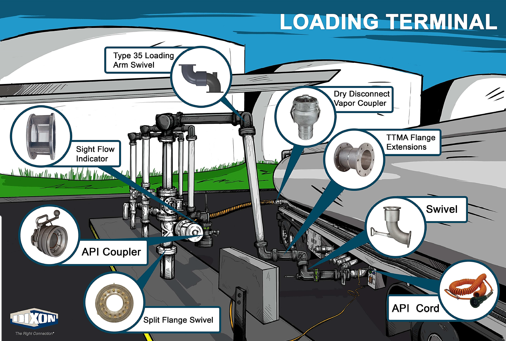

# Dixon Industrial Loading Arms (Standard & Scissor Styles)

**Brand:** Dixon  
**Category:** Terminal Equipment / Loading Systems / Loading Arms  
**SKU:** DX-LA-SYS  
**Status:** Build-to-Order / Custom Configurations

---

## Short Description
**Dixon Loading Arms** are robust, articulating pipe systems designed for the safe and efficient transfer of hazardous liquids, petroleum fuels, gases, and dry bulk materials. Available in both standard and scissor configurations, these systems utilize heavy-duty swivels and torsion spring counterbalances to provide fluid movement, high flow capacities, and safe operator handling for top-loading and bottom-loading applications.

- **Nominal Sizes:** 2", 3", and 4"
- **Configurations:** Standard (Scissoring / Fixed Reach) and Scissor Style
- **Counterbalance:** Left or right-handed torsion spring assemblies
- **Materials:** High-grade Aluminum, Carbon Steel, and 316 Stainless Steel

---

## Product Gallery
  

---

## Detailed Description

### Overview
Automating terminal fluid transfers requires durable loading systems that reduce operator fatigue and minimize spill risks. **Dixon Industrial Loading Arms** replace flexible hoses with rigid piping, providing structural strength, leak-free swivels, and custom configurations. Whether loading railcars, tanker trucks, drums, or IBC totes, these loading arms offer a safe, long-lasting connection.

### Core Components
- **Style 50 Loading Swivel:** Precision-engineered swivel joint that allows rotation in multiple planes while maintaining a leak-tight seal.
- **Torsion Spring Counterbalance:** Housed spring system that offsets the weight of the arm and piping, allowing the operator to lift, lower, and position the arm with minimal physical effort.
- **Breakaway & Dry Disconnects:** Compatible with Dixon safety breakaway couplings and Dry-Disconnect valves to prevent spills and catastrophic damage during accidental drive-aways.

---

## Key Features & Benefits
*   **Articulated Design:** Allows fluid, 360-degree rotation at terminal joints.
*   **Media Versatility:** Multiple elastomer options (Nitrile, FKM, low-temp FKM, PTFE, EPDM, food-grade Nitrile) to handle food-grade products, aggressive chemicals, or petroleum fuels.
*   **Convertible Loading:** Configurable for both top-loading (open dome or closed connection) and bottom-loading (standard API coupler connection).
*   **Modular Accessories:** Accessories include Wet-R-Dri™ valves, remote handles, deflectors, diffusers, and vacuum breakers.

---

## Technical Specifications

### Technical Fact Sheet
Below is the technical specification table comparing the **Standard Loading Arm** and **Scissor Style Loading Arm** product lines:

| Specification Attribute | Standard Loading Arm | Scissor Style Loading Arm |
| :--- | :--- | :--- |
| **Available Sizes** | 3" and 4" | 2", 3", and 4" |
| **Typical Application** | Top / Bottom Loading (Truck & Railcar) | Top Loading (Compact / Variable Reach) |
| **Leg Pipe Materials** | Aluminum, Carbon Steel, 316 Stainless Steel | Aluminum, Carbon Steel, 316 Stainless Steel |
| **Base Swivel Options** | Carbon Steel V-Ring, CS Split Flange, 316 SS Split Flange | Carbon Steel V-Ring, CS Split Flange, 316 SS Split Flange |
| **Seal Elastomers** | Nitrile, FKM, Low-Temp FKM, PTFE, EPDM, Food-Grade Nitrile | Nitrile, FKM, Low-Temp FKM, PTFE, EPDM, Food-Grade Nitrile |
| **Standard Configuration** | CS Base Swivel, ESB1 Torsion Counterbalance, TTMA Extension, API Coupler, D-Handle | CS Split Flange Base Swivel, Aluminum Legs, Top Load Valve, Remote Handle, FKM Seals |
| **Optional Accessories** | Safety Breakaway, Wet-R-Dri™ Valve, Ball Handle | Tee Deflector, Diffuser, Top-Load Valve, Locking Mechanism |

---

## Applications & Use Cases
*   **Petroleum Terminals:** Bottom-loading of gasoline and diesel fuels into cargo tankers.
*   **Chemical Plants:** Transfer of acids, bases, and solvents into railcars or ISO containers.
*   **Aviation Fueling:** Top-loading of jet fuel into specialized airport refueling trucks.
*   **Food Processing:** Transfer of edible oils, syrups, and alcohols using food-grade Nitrile seals.

---

## References & Sources
1.  **Local Source:** `DIXON PRoduct.docx` (Extracted Text: `DIXON PRoduct_extracted.txt`)
2.  **Manufacturer Catalog:** Dixon Industrial Loading Arms Ordering & Sizing Guide
3.  **Official Site:** [Dixon Valve & Coupling Company](https://www.dixonvalve.com)
