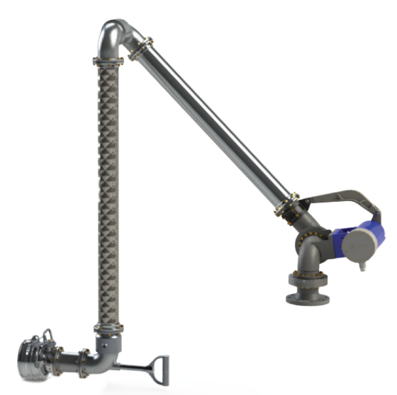
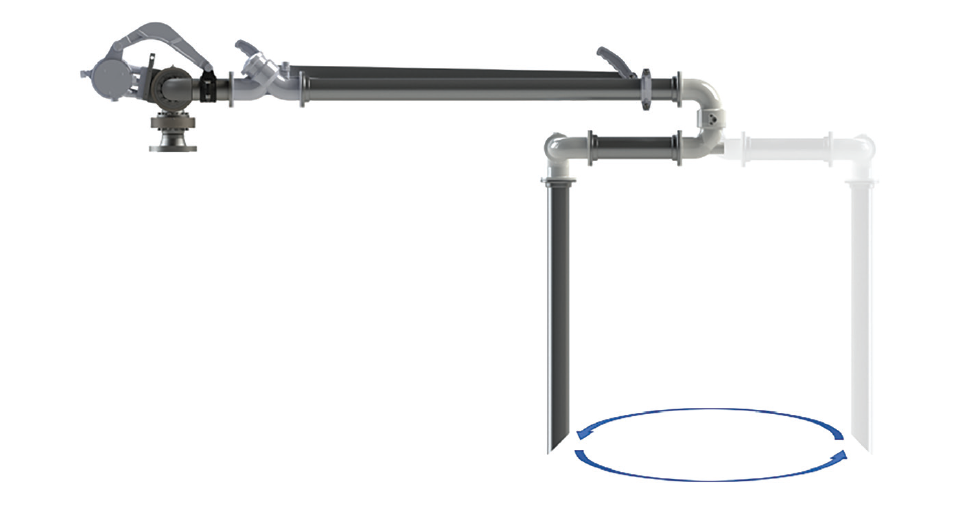

# Dixon FT7000-Series Overfill Protection Rack Monitors

**Brand:** Dixon  
**Category:** Terminal Equipment / Safety Systems / Overfill Protection  
**SKU:** DX-FT7000-OPM  
**Status:** In Stock / Ready to Ship

---

## Short Description
The **Dixon FT7000-Series Overfill Protection Rack Monitor** is a state-of-the-art terminal safety controller designed to prevent tank overflows during hazardous liquid transfer operations. Installed on the gantry, this monitor automatically switches between 2-wire (thermistor) and 5-wire (optic) sensor systems, verifying ground connection and trailer identification before permitting fluid flow. Equipped with redundant relay outputs, it prevents single-point failure to ensure maximum safety.

- **Dual Sensor Compatibility:** Automatic detection and switching between 2-wire and 5-wire sensors.
- **Safety Approvals:** Class I, Division 1, Group CD and Class I, Zone 1, Group IIB; certified to API RP1004 and EN13922.
- **Communications:** RS485 communication port for remote monitoring and terminal automation.
- **Physical Rating:** Heavy-duty, narrow-depth enclosure rated to IP66.

---

## Product Gallery
  

---

## Detailed Description

### Overview
During bulk fuel loading, overfills present severe fire hazards, environmental risks, and financial liabilities. The **Dixon FT7000-Series Rack Monitor** serves as the central control device on the loading rack gantry. It monitors the liquid level sensors inside the truck or railcar compartments. If any compartment reaches its high-level limit, or if the ground loop is interrupted, the monitor instantly outputs a signal to shut off the loading pumps or close the control valves.

### Advanced Safety Controls
- **Redundant Relay Outputs:** Designed with independent relays to ensure that even if one relay fails, the system will still shut down the flow, eliminating single-point-of-failure risks.
- **Ground Loop Verification:** Constantly checks for a secure ground path between the trailer chassis and the rack. If a static ground is lost, loading is immediately halted.
- **Trailer Identification Module (TIM):** Reads the trailer ID modules to verify compartment configurations and load historical data, integrating seamlessly with terminal management systems.

---

## Key Features & Benefits
*   **Auto-Switching Intelligence:** Automatically detects whether the incoming trailer utilizes a 2-wire or 5-wire sensor array, eliminating manual selector switches.
*   **12-Compartment Status Display:** Bi-color LED indicators provide operators with immediate, clear status feedback on each compartment (Green = Safe, Red = Wet/Overfill).
*   **RS485 & RackView Software:** Easily links to terminal automation systems to manage and log loading events, bypass occurrences, and trailer IDs.
*   **Wireless Bypass System:** Key-operated bypass system allows authorized personnel to override sensors for troubleshooting or special loading scenarios under controlled protocols.

---

## Technical Specifications

### Technical Fact Sheet
The table below outlines the electrical, mechanical, and safety specifications of the FT7000-Series Rack Monitor:

| Attribute | Specification Details |
| :--- | :--- |
| **Model Series** | FT7000 |
| **Power Requirements** | 110V – 240V AC, 50/60 Hz |
| **Power Consumption** | Max 13 Watts |
| **5-Wire (Optic) Support** | 1 to 12 sensors |
| **2-Wire (Thermistor) Support**| 1 to 8 sensors (Black/White, Grey-Grey Universal, and Analog) |
| **Environmental Protection**| IP66 Dust & Water Ingress Protection |
| **Communications Port** | RS485 Serial Interface (Modbus protocol compatible) |
| **Bypass Override** | Key-activated wireless bypass system |
| **Relay Outputs** | Redundant dry-contact relays, rated up to 250V AC / 5A |
| **Weight** | Approx. 38 lbs (17.2 kg) |
| **Approvals & Standards** | API RP1004, EN13922, CSA, ATEX, and IECEx |
| **Hazardous Area Rating** | Class I, Div 1, Group CD; Class I, Zone 1, Group IIB |

---

## Applications & Use Cases
*   **Petroleum Loading Racks:** Gantry automation for gasoline, diesel, and aviation fuel distribution.
*   **Chemical Bulk Terminals:** Safe containment controls for solvents and toxic liquid transfers.
*   **Rail Car Loading Terminals:** Multi-compartment railcar liquid leveling and safety ground checks.

---

## References & Sources
1.  **Local Source:** `DIXON PRoduct.docx` (Extracted Text: `DIXON PRoduct_extracted.txt`)
2.  **Manufacturer Catalog:** Dixon FT7000-Series Overfill Protection Rack Monitor Manual
3.  **Official Site:** [Dixon Valve & Coupling Company](https://www.dixonvalve.com)
