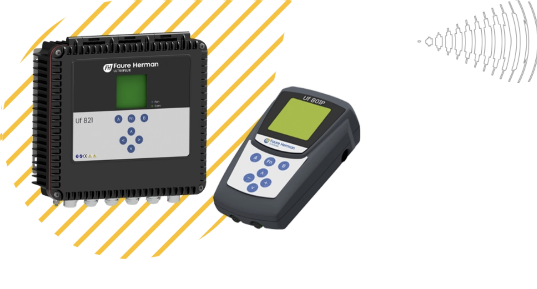
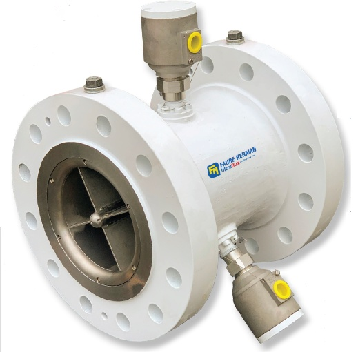
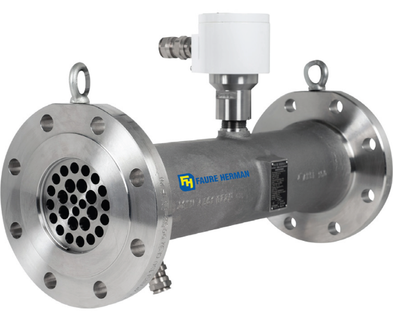

# Faure Herman Heliflu® Helical Turbine Flowmeters (TZN & TLM Series)

**Brand:** Faure Herman  
**Category:** Flowmeters / Turbine Flowmeters / Helical Turbine Flowmeters  
**SKU:** FH-HELI-HTF  
**Status:** Build-to-Order / Custody Transfer Approved

---

## Short Description
The **Faure Herman Heliflu® Series** represents the gold standard in high-accuracy helical turbine flow measurement. Consisting of the premium **Heliflu®-TZN Master Meter** and the compact **Heliflu™ TLM**, these meters feature advanced helical rotors designed to measure low-to-high viscosity liquids and refined products. With exceptional pulse stability and low pressure drop, they are the preferred choice for pipeline custody transfer, marine terminals, and master metering.

- **Viscosity Range:** Suitable for high viscosities greater than 350 cSt with custom calibration.
- **Repeatability:** Outstanding repeatability (±0.02%), ideal for Master Meter verification.
- **Integrated Conditioning (TLM):** Built-in flow conditioner permits installation without straight pipe runs.
- **Cartridge System (TZN):** Removable measuring cartridge allows for complete service in under an hour.

---

## Product Gallery
  
  

---

## Detailed Description

### Overview
In custody transfer metering, accuracy, repeatability, and reliability are paramount. The **Heliflu® Series** addresses these needs by combining 90+ years of Faure Herman metering experience with advanced helical turbine geometry. Unlike standard straight-vane turbine meters, the helical rotor design ensures minimal sensitivity to viscosity and density variations, making it highly accurate even when wetted with complex hydrocarbons or crude oils.

### Sub-Products / Models in this Series

#### 1. Heliflu®-TZN (Premium / Master Meter)
The TZN features an optimized helical rotor supported by low-friction bearings. It is custom calibrated to the user's specific operating viscosities and is designed as the ultimate master reference meter. Its cartridge-style assembly allows wetted components to be serviced or replaced within an hour, minimizing service downtime.

#### 2. Heliflu™ TLM (Compact / Integrated Conditioning)
The TLM is designed for installations where space and weight are severely restricted, such as airport refuelers, wagon loaders, and marine skids. It features a space-saving design with a built-in flow conditioner. It can be installed directly downstream of valves or bends without requiring long straight pipe runs, yet still maintains custody transfer accuracy.

---

## Key Features & Benefits
*   **Viscosity Immunity:** Custom-calibrated curves allow accurate measurement of high viscosities (over 350 cSt) without drift.
*   **Low Pressure Drop:** The helical rotor creates minimal flow resistance, lowering energy costs.
*   **Life Cycle Adaptability:** Offers Downsizing ("DS") and Flexible Flowrates ("FF") options to adapt to changes in process rates.
*   **Superior Pulse Stability:** High pulse resolution reduces the required prover volume, simplifying calibration checks.
*   **Global Compliance:** Certified for custody transfer by OIML R117, MID, ATEX, and IECEx.

---

## Technical Specifications

### Technical Fact Sheet
Below is the technical specification table comparing the Heliflu TZN and Heliflu TLM models:

| Attribute | Heliflu®-TZN | Heliflu™ TLM |
| :--- | :--- | :--- |
| **Typical Service** | Master Metering / Main Custody Transfer | Light Product Transfer / Compact Terminals |
| **Viscosity Limit** | High Viscosity (> 350 cSt) | Low to Medium Viscosity |
| **Linearity (Standard)** | ±0.15% to ±0.20% | ±0.15% |
| **Repeatability** | ±0.02% (Master Meter Grade) | ±0.02% |
| **Flow Conditioning** | Requires upstream straight pipe | Integrated flow conditioner (no runs required) |
| **Maintenance Design** | Removable cartridge (service < 1 hour) | Removable cartridge |
| **Standard Sizes** | DN 50 to DN 500 (2" to 20") | DN 50 to DN 150 (2" to 6") |
| **Pressure Class** | ASME 150# to 1500# | ASME 150# to 600# (PN 16 to PN 100) |
| **Wetted Materials** | Stainless Steel / Special Alloys | Stainless Steel / Carbon Steel |
| **Outputs** | Dual frequency pulses (NAMUR), HART, Modbus | Dual frequency pulses, HART |

---

## Applications & Use Cases
*   **Pipeline Custody Transfer:** High-accuracy oil and refined product measurement between operators.
*   **Master Meter Proving:** Mobile reference standard to prove other in-line meters.
*   **Marine & FPSO Terminals:** Tanker loading/offloading and storage management on offshore vessels.
*   **Airport Refueling Systems:** Compact TLM flowmeters mounted on aircraft refueler trucks and hydrants.

---

## References & Sources
1.  **Local Source:** `FAURE HERMAN.docx` (Extracted Text: `FAURE HERMAN_extracted.txt`)
2.  **Manufacturer Catalog:** Faure Herman Heliflu Turbine Flowmeters Technical Specification
3.  **Official Site:** [Faure Herman Official Website](https://faureherman.com)
