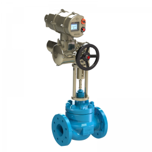

# Hankun Cage Type Single Seated Control Valves (with HITORK® Actuators)

**Brand:** Hankun (automated with HITORK® Actuators)  
**Category:** Valves / Control Valves / Globe Control Valves  
**SKU:** HK-CAGE-SCV  
**Status:** Build-to-Order / Modulatable

---

## Short Description
The **Hankun Cage Type Single Seated Control Valve** is a heavy-duty process control valve engineered for modulating service under extreme pressure drops, where flashing or cavitation occurs. Featuring a robust, wetted cage-guided trim design, it offers high vibration resistance and isolates the valve body from erosion. When paired with **HITORK® Intelligent Actuators**, it provides precise, fast-response digital flow control.

- **Trim Design:** Fluid pressure-balanced, wetted cage-guided plug.
- **Vibration Resistance:** High-durability top guide with a large sliding surface.
- **Standard Actuation:** Multi-spring diaphragm pneumatic actuators or HITORK® intelligent electric actuators.
- **Safety Standard:** Shut-off performance fully complies with IEC and JIS standards.

---

## Product Gallery
  

---

## Detailed Description

### Overview
In power plants, petrochemical facilities, and heavy refining, modulating control valves are exposed to severe differential pressures that generate cavitation, sound vibration, and body erosion. The **Hankun Cage Type Control Valve** manages this kinetic energy within its wetted cage. Rather than throttling across the body seat, wetted flow passes through specialized cage windows, restricting erosion to the replaceable trim parts and extending the service life of the valve body.

### Design Advantages
- **Cage-Guided Trim:** The plug is continuously supported by the inner wall of the cage, preventing oscillation and lateral vibration even under extreme fluid velocities.
- **S-Shaped Flow Passage:** The streamlined valve body design minimizes flow turbulence and pressure loss, yielding high flow capacity (Cv) and wide rangeability (up to 50:1).
- **Fast Seating & Tight Shut-off:** Soft-seated configurations provide bubble-tight shut-off (ANSI Class VI), while metal seats provide Class IV or V shut-off under high temperatures.

### HITORK® Actuator Integration
- **Intelligent Electric Actuators (HITORK 2.0 / HKM Series):** Features non-intrusive setup, high-resolution absolute encoders, self-diagnostics, and multi-bus communication protocols (Modbus, Profibus, HART, Bluetooth).
- **Pneumatic Diaphragm Actuators:** Multi-spring design provides a fail-safe mechanical return (spring-to-open or spring-to-close) with direct NAMUR positioner mounting.

---

## Key Features & Benefits
*   **Anti-Cavitation / Low Noise:** Cage windows can be customized (drilled hole patterns) to dissipate energy and prevent cavitation noise.
*   **Easy Maintenance:** Top-entry design allows wetted seat rings and cages to be replaced quickly without cutting the valve body from the pipe.
*   **High Temperature Tolerance:** Design options range from cryogenic service up to +565°C using extension bonnets.
*   **Balance Seal Rings:** Balanced plug options reduce operating thrust requirements, allowing for smaller, more economical actuator selection.

---

## Technical Specifications

### Technical Fact Sheet
Below is the technical specification table for the Hankun Cage Type Control Valve series:

| Parameter | Specification Details |
| :--- | :--- |
| **Nominal Sizes** | DN 25 to DN 300 (1" to 12" - larger on request) |
| **Pressure Ratings** | PN 16, 40, 63, 100 / ASME Class 150, 300, 600 |
| **Flow Characteristics** | Equal Percentage, Linear, Quick Opening |
| **Leakage Class** | Metal Seat: ANSI Class IV / V; Soft Seat: ANSI Class VI |
| **Body Materials** | Carbon Steel (WCB, LCB), Stainless Steel (CF8, CF8M, CF3M), WC6, WC9 |
| **Trim Materials** | 304, 316, 316L Stainless Steel with optional Stellite hardening |
| **Operating Temp** | -196°C to +565°C (using appropriate cryogenic or high-temp bonnets) |
| **Actuator Control** | Modulating (4-20mA, 1-5V DC, HART, Modbus) or On/Off |
| **Pneumatic Air Supply** | 3.0 to 6.0 bar (43.5 to 87 psi) |

---

## Applications & Use Cases
*   **Power Boiler Blowdown:** Modulating blowdown rates under high differential pressures.
*   **High-Pressure Gas Bypass:** Depressurization and bypass loops where noise reduction is critical.
*   **Petroleum Refining:** Control of hot oils, gas feed lines, and catalyst steam loops.
*   **Chemical Reactor Feed:** Precision dosing of liquid chemicals into pressurized wetted vessels.

---

## References & Sources
1.  **Local Source:** `HITORK.docx` (Extracted Text: `HITORK_extracted.txt`)
2.  **Manufacturer Catalog:** Hankun Control Valve & HITORK Actuators Technical Manual
3.  **Official Site:** [Hankun Valves & Controls](http://www.hankunvalve.com)
