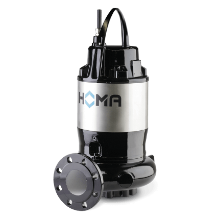
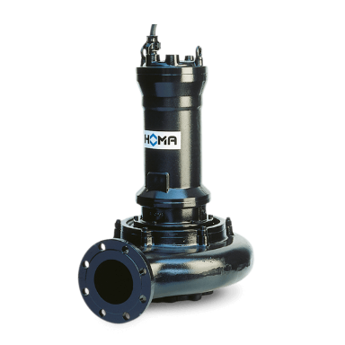
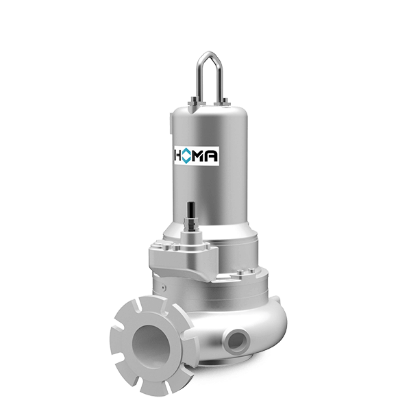

# HOMA Submersible Sewage & Effluent Pumps

**Brand:** HOMA Pumpen  
**Category:** Pumps / Submersible Pumps / Sewage Pumps  
**SKU:** HM-SUB-SEW  
**Status:** In Stock / Ready to Configure

---

## Short Description
**HOMA Submersible Sewage Pumps** are heavy-duty municipal and industrial wastewater pumps designed for the transfer of raw sewage, effluent, and sludges containing high concentrations of solids and fibrous materials. Engineered for long-term submersion, the series features robust cast iron or stainless steel construction, dual mechanical seals, and high-efficiency impellers (Single Channel, Vortex, and Stainless Steel options) to provide clog-free operation.

- **Discharge Sizes:** DN 80, DN 100, and DN 150
- **Spherical Clearance:** 80 mm to 100 mm (prevents clogging from large solids)
- **Motor Power Range:** Up to 43 kW (58 HP)
- **Impeller Types:** Single Channel (high flow), Vortex V(X) (fibrous solids), and CMX(S) Stainless Steel (corrosive media)

---

## Product Gallery
  
  
  

---

## Detailed Description

### Overview
In municipal sewage networks and industrial water treatment, pumps must handle highly variable flows and wetted solids without clogging. **HOMA Submersible Sewage Pumps** utilize large-passage impellers and heavy-duty electric motors designed for continuous (S1) operation under fully submerged or dry-pit configurations.

### Impeller Variations (Sub-Products)

#### 1. Single Channel Impeller Sewage Pumps (Standard Cast Iron)
Designed for high volume transfer of raw sewage, municipal effluent, and sludge. The single-channel design offers high hydraulic efficiency while allowing large solids up to 100mm to pass easily.
- *Best For:* Main lift stations, stormwater runoff, and municipal sewer mains.

#### 2. V(X) Series (Vortex Impeller Sewage Pumps)
Utilizes a recessed vortex impeller located completely out of the flow stream. The rotation of the impeller creates a whirlpool (vortex) in the pump casing, drawing solids through the pump without wetted contact with the impeller.
- *Best For:* Liquids containing long fibers, gassy liquids, and rags.

#### 3. CMX(S) Series (Stainless Steel Sewage Pumps)
Built from cast 316 stainless steel for chemical resistance. Fitted with single-channel impellers, these pumps are engineered to handle aggressive municipal chemicals, industrial acidic washdown, and corrosive industrial sewage.
- *Best For:* Chemical processing waste, food processing plants, and marine environments.

---

## Key Features & Benefits
*   **Dual Mechanical Seals:** Silicon carbide mechanical seals housed in an oil chamber protect the motor from fluid ingress.
*   **Large Spherical Passages:** 80mm to 100mm clearances ensure that rags, wipes, and debris pass without jamming.
*   **Explosion-Proof Motors:** Available with ATEX-compliant explosion-proof motors (Class I, Div 1) for hazardous gas locations.
*   **Auto-Coupling System:** Optional cast iron guide rail system allows the pump to be lowered into a wet well and automatically connect to discharge piping without wetted entry.

---

## Technical Specifications

### Technical Fact Sheet
The table below provides a detailed comparison of the three HOMA submersible sewage pump sub-products:

| Specification Attribute | Single Channel (Cast Iron) | V(X) Vortex Series | CMX(S) Stainless Steel |
| :--- | :--- | :--- | :--- |
| **Discharge Size** | DN 80 / DN 100 / DN 150 | DN 80 / DN 100 | DN 80 / DN 100 / DN 150 |
| **Max Flow Rate** | 72.0 to 390.0 m³/h | 54.0 to 228.0 m³/h | 68.2 to 384.1 m³/h |
| **Max Head** | 4.8 to 42.2 m | 7.0 to 53.8 m | 2.0 to 42.1 m |
| **Spherical Clearance** | 80 to 100 mm | 80 to 100 mm | 80 to 100 mm |
| **Motor Power (P1)** | 1.7 to 43.0 kW | 1.5 to 30.0 kW | 1.7 to 43.0 kW |
| **Motor Power (P2)** | Up to 25.4 kW | 1.3 to 25.4 kW | Up to 25.4 kW |
| **Nominal Speed** | 2900 / 1450 / 960 rpm | 2900 / 1450 / 960 rpm | 2900 / 1450 / 960 rpm |
| **Body Material** | Cast Iron GG25 (GJL-250) | Cast Iron GG25 (GJL-250) | Stainless Steel 316 (1.4408) |
| **Impeller Material** | Cast Iron GG25 | Cast Iron GG25 | Stainless Steel 316 (1.4408) |

---

## Applications & Use Cases
*   **Municipal Sewage Lift Stations:** Pumping raw waste from collection basins to treatment facilities.
*   **Industrial Effluent Disposal:** Dewatering manufacturing waste, pulp fibers, and washdown.
*   **Stormwater Drainage:** High-volume drainage of storm basements and civil excavations.
*   **Corrosive Sewage Handling:** CMX(S) pumps used in chemical, food, and maritime shipping lines.

---

## References & Sources
1.  **Local Source:** `HOMA PUMPEN.docx` (Extracted Text: `HOMA PUMPEN_extracted.txt`)
2.  **Manufacturer Catalog:** HOMA Submersible Sewage Pumps Series C & V Brochure
3.  **Official Site:** [HOMA Pumpen Official Website](https://www.homapumpen.de)
