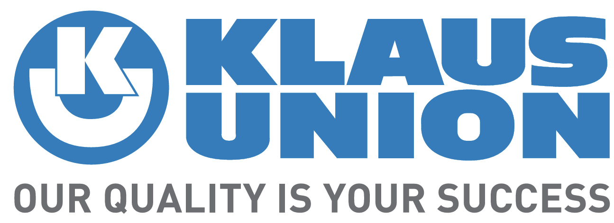
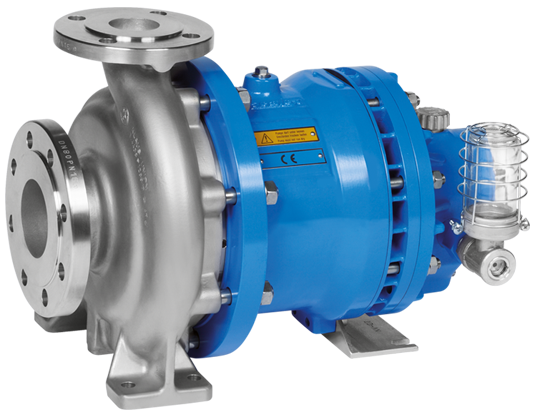
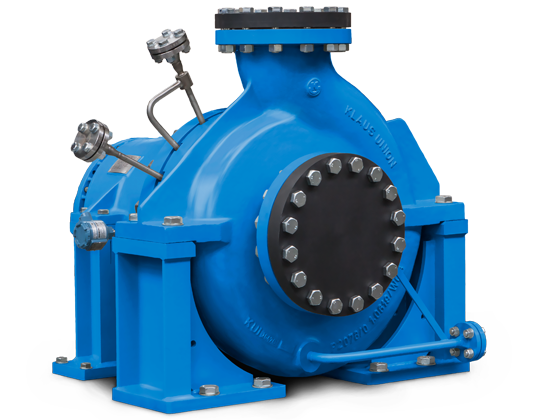
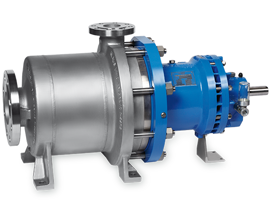
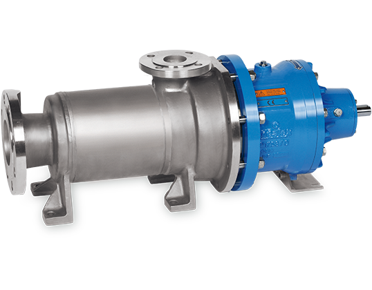

# Klaus Union SLM Magnetic Drive Centrifugal Pumps

**Brand:** Klaus Union  
**Category:** Pumps / Sealless Pumps / Magnetic Drive Centrifugal Pumps  
**SKU:** KU-SLM-MDP  
**Status:** Build-to-Order / Request Quote

---

## Short Description
The **Klaus Union SLM Magnetic Drive Centrifugal Pump Series** consists of premium sealless pumps engineered for leak-free, zero-emission transport of hazardous, toxic, explosive, and high-value wetted fluids. By replacing traditional mechanical seals with an hermetically sealed containment shell and a magnetic coupling, these pumps provide 100% containment compliance with ISO 15783 and API 685 standards.

- **Sealless Safety:** Containment shell creates an hermetic seal, eliminating mechanical seal failure risks.
- **Extreme Temperature Range:** Performs reliably from -200°C up to +550°C.
- **Maximum Pressure:** Designed for system pressures up to PN 400 (5800 psi).
- **Sub-Products in Series:** SLM NV (Standard), SLM AP (API 685), SLM GV (Multi-Stage), SLM SV (Side Channel), and SLM NVT (Submerged).

---

## Product Gallery
  
  
  
  

---

## Detailed Description

### Overview
In chemical plants, gas processing, and high-temperature heat transfer loops, leakage of wetted media cannot be tolerated. The **Klaus Union SLM Series** utilizes high-performance permanent magnets (typically Samarium Cobalt) to transmit torque from the motor shaft to the wetted impeller through a stationary containment shroud. Because there is no shaft penetrating the pump body, there are no dynamic wetted seals to wear out or leak.

### Sub-Products / Models in this Series

#### 1. SLM NV (Standard ISO Centrifugal)
Standard sealless centrifugal pump designed in compliance with DIN EN ISO 2858 and DIN EN ISO 15783. Used widely across chemical and general process lines.
- *Best For:* Clean chemical transfer, acids, solvents, and heat transfer oils.

#### 2. SLM AP (API 685 Heavy Duty)
Specifically designed to meet API 685 specifications for petroleum, petrochemical, and natural gas industries. Built with heavier wall thicknesses and advanced instrumentation ports.
- *Best For:* Hydrocarbons, hot oils, volatile organic compounds (VOCs).

#### 3. SLM GV (Multi-Stage High Head)
A multi-stage centrifugal magnetic drive pump designed to deliver extremely high heads (up to 2,200 meters) at lower flow rates.
- *Best For:* High-pressure reactor feeds, boiler water feed, and condensation loops.

#### 4. SLM SV (Multi-Stage Side Channel)
A sealless side-channel pump designed to handle entrained gas (up to 50%) and provide self-priming capabilities.
- *Best For:* Liquefied gases (LPG, ammonia), volatile solvents, and tank unloading.

#### 5. SLM NVT (Submerged Sump Pump)
A vertical sealless submerged pump designed to be lowered directly into storage sumps, tanks, and caverns with submerging depths up to 6 meters.
- *Best For:* Wet pit sump drainage, toxic waste collection, and bulk tank pumping.

---

## Key Features & Benefits
*   **Zero Leakage (Sealless):** Prevents dynamic wetted seal failures, protecting personnel and the environment.
*   **Dual Containment Option:** Secondary control systems or double containment shrouds available for maximum safety.
*   **Internal Flush Lubrication:** Wetted bearings are lubricated and cooled by the pumped fluid, eliminating external flush lines.
*   **Solid Silicon Carbide Bearings:** High-purity SiC radial and thrust bearings resist wear and handle harsh chemical wetted environments.

---

## Technical Specifications

### Technical Fact Sheet
Below is the technical specification table comparing the wetted capabilities of each pump model in the SLM Magnetic Drive Centrifugal series:

| Model Specification | SLM NV | SLM AP | SLM GV | SLM SV | SLM NVT |
| :--- | :--- | :--- | :--- | :--- | :--- |
| **Design Standard** | DIN EN ISO 2858 / 15783 | API 685 | DIN EN ISO 15783 / API 685 | DIN EN ISO 15783 | ISO 2858 / ISO 15783 |
| **Max Flow Rate** | 3,500 m³/h | 3,500 m³/h | 300 m³/h | 42 m³/h | 3,500 m³/h |
| **Max Delivery Head** | 220 m | 220 m | 2,200 m | 470 m | 220 m |
| **Temperature Range** | -200°C to +550°C | -200°C to +550°C | -120°C to +350°C | -120°C to +250°C | -40°C to +200°C |
| **Max Pressure Rating**| PN 400 (5800 psi) | PN 400 (5800 psi) | PN 250 (3600 psi) | PN 400 (5800 psi) | PN 63 (910 psi) |
| **Max Submerged Depth**| N/A | N/A | N/A | N/A | 6,000 mm |

---

## Applications & Use Cases
*   **Toxic Chemical Transfer:** Leak-free transfer of chlorine, acids, phosgene, and ammonia.
*   **High-Temperature Thermal Oil:** Recirculation of hot synthetic oils in refinery process loops.
*   **Cryogenic Liquids:** Pumping of liquid gases, nitrogen, and oxygen.
*   **Refinery Offsites:** Transfer of light hydrocarbons, condensate, and high-vapor-pressure fuels.

---

## References & Sources
1.  **Local Source:** `Klaus Union.docx` (Extracted Text: `Klaus Union_extracted.txt`)
2.  **Manufacturer Catalog:** Klaus Union Sealless Magnetic Drive Pumps Technical Catalog
3.  **Official Site:** [Klaus Union Official Website](https://www.klaus-union.de)
