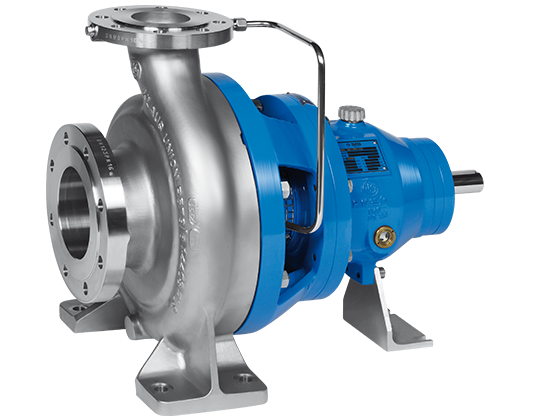
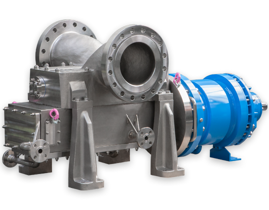

# Klaus Union SLM DSP-2C Magnetic Drive Twin Screw Pumps

**Brand:** Klaus Union  
**Category:** Pumps / Sealless Pumps / Twin Screw Pumps  
**SKU:** KU-DSP2C-MSP  
**Status:** Build-to-Order / Request Quote

---

## Short Description
The **Klaus Union SLM DSP-2C** is a sealless, magnetic drive, single-volute twin screw pump designed in compliance with API 676 and API 685 standards. Engineered to handle highly viscous fluids, multiphase fluid mixtures, and abrasive sludges without dynamic shaft leakage, it combines the positive displacement pumping capability of twin screw pumps with the 100% leak-free containment of a magnetic drive system.

- **High Viscosity Handling:** Handles wetted fluids up to 100,000 cSt.
- **Multiphase Pumping:** Capable of pumping liquid/gas mixtures without vapor lock.
- **API Compliance:** Designed to API 676 (Positive Displacement Pumps) and API 685 (Sealless Centrifugal/Rotary Pumps).
- **Max Flow Rate:** Up to 1,800 m³/h (7,900 GPM) at differential pressures up to 40 bar.

---

## Product Gallery
  

---

## Detailed Description

### Overview
In oil production, refinery asphalt processing, and petrochemical terminals, wetted fluids are often highly viscous, abrasive, and wetted with entrained gases. Traditional twin screw pumps require expensive double mechanical seals and external barriers to prevent environmental leaks. The **Klaus Union SLM DSP-2C** eliminates these seals. By enclosing the wetted rotors and drive gears within a single hermetic casing wetted with a magnetic drive, it provides dry-running capability during priming and 100% emission-free operation.

### Operating Principle
The pump utilizes two intermeshing wetted screws (one drive screw and one idler screw) housed within a close-fitting liner. As the screws rotate, wetted fluid is trapped in the cavities between the screw threads and is pushed axially along the pump body toward the discharge port. Because the screws do not contact each other directly (synchronized by external wetted timing gears), wetted wear is minimized, allowing the pump to handle abrasive slurries.

### Design Advantages
- **Magnet Drive Containment:** A sealless shroud isolates wetted process fluid from the outside environment.
- **Single-Volute Axial Flow:** Balanced axial forces prevent internal vibration and ensure smooth, pulsation-free flow.
- **Integral Timing Gears:** Gears are wetted in an isolated oil reservoir or process-lubricated to synchronize screw rotation precisely.

---

## Key Features & Benefits
*   **Sealless Hermetic Isolation:** Eliminates dynamic wetted shaft seals, reducing maintenance costs by up to 70% and preventing fugitive VOC emissions.
*   **Multiphase Flow:** Capable of pumping wetted fluids containing up to 90% gas pockets without dry-run damage.
*   **Low Shear Pumping:** Gentle axial transport prevents emulsification of oils and water.
*   **High Suction Lift (Self-Priming):** Outstanding self-priming capability allows for rapid evacuation of empty pipelines.

---

## Technical Specifications

### Technical Fact Sheet
Below is the technical specification table for the Klaus Union SLM DSP-2C Twin Screw Pump:

| Parameter | Specification Details |
| :--- | :--- |
| **Design Standards** | API 676, API 685, DIN EN ISO 15783 |
| **Max Flow Rate** | 1,800 m³/h |
| **Max Differential Pressure** | Up to 40 bar (580 psi) |
| **Operating Temp Range** | -120°C to +400°C |
| **Maximum System Pressure** | Max PN 400 (5800 psi) |
| **Viscosity Limits** | 0.5 to 100,000 mm²/s (cSt) |
| **Rotor Style** | Double-suction, non-contact twin screw |
| **Body Materials** | WCB Carbon Steel, CF8M Stainless Steel, Duplex, Alloy 20 |
| **Screw Materials** | Nitrided Steel, Hard-faced Stainless, Duplex Steel |

---

## Applications & Use Cases
*   **Crude Oil Extraction:** Unloading multi-phase oil and gas wells wetted with sand.
*   **Refinery Asphalt & Bitumen:** Safe, leak-free pumping of high-temperature asphalt, tar, and heavy fuel oils.
*   **Terminal Loading/Unloading:** Bulk transfer of chemical raw materials, heavy crude, and refined products from ships and rail cars.
*   **Slop Oil & Waste Sludge:** Pumping of oil-water-sand separators in waste treatment facilities.

---

## References & Sources
1.  **Local Source:** `Klaus Union.docx` (Extracted Text: `Klaus Union_extracted.txt`)
2.  **Manufacturer Catalog:** Klaus Union Sealless Twin Screw Pumps SLM DSP-2C Manual
3.  **Official Site:** [Klaus Union Official Website](https://www.klaus-union.de)
