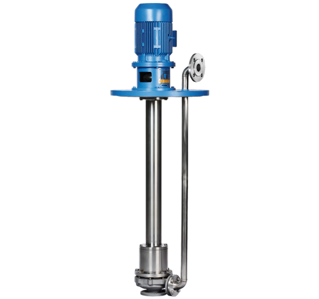

# Klaus Union NOV Centrifugal Pumps (Mechanical Seal)

**Brand:** Klaus Union  
**Category:** Pumps / Centrifugal Pumps / Mechanical Seal Centrifugal Pumps  
**SKU:** KU-NOV-MSP  
**Status:** Build-to-Order / Request Quote

---

## Short Description
The **Klaus Union NOV Centrifugal Pump** is a high-reliability, wetted shaft pump equipped with mechanical shaft seals. Designed in accordance with DIN EN ISO 2858 and DIN EN ISO 5199, this series is engineered for heavy-duty industrial and chemical transfer services where sealless magnetic drive couplings are not required or where solids content prevents the use of internal product-lubricated bearings.

- **Design Standard:** Built to DIN EN ISO 2858 and DIN EN ISO 5199.
- **Sealing Design:** Single or double mechanical shaft seals with API flushing plans.
- **Max Flow Rate:** Up to 3,500 m³/h (15,400 GPM).
- **Max Delivery Head:** Up to 220 meters (720 ft).

---

## Product Gallery

---

## Detailed Description

### Overview
While magnetic drive sealless pumps are ideal for toxic fluids, mechanical seal centrifugal pumps remain the industrial standard for general-purpose applications, high solids suspensions, or where flushing systems can safely isolate wetted media. The **Klaus Union NOV Series** provides robust mechanical sealing options, high hydraulic efficiencies, and a "back pull-out" design that simplifies routine wetted component maintenance.

### Mechanical Sealing Configurations
- **Single Mechanical Seal:** Cost-effective solution for clean, non-hazardous wetted liquids.
- **Double Mechanical Seal (Back-to-Back or Tandem):** Utilizes an external barrier fluid system (e.g., API Plan 52 or 53) to completely isolate wetted process fluids from the atmosphere, providing maximum emissions control.

### Design Advantages
- **Heavy-Duty Bearing Frame:** Oversized shaft and grease/oil-lubricated ball bearings reduce shaft deflection and extend mechanical seal life.
- **Back Pull-Out Construction:** Allows removal of the entire bearing frame, shaft, impeller, and seal assembly without disconnecting the pump casing from wetted suction and discharge piping.

---

## Key Features & Benefits
*   **High Performance Hydraulics:** Optimized closed impeller designs provide peak efficiency and low net positive suction head (NPSHr) requirements.
*   **API 5199 Compliance:** Built to resist thermal casing deformation and pipe loads, ensuring shaft alignment.
*   **Solid Solids Handling:** Outperforms magnetic drive pumps when wetted with fluids containing small particulates, as wetted bearings are isolated from wetted process media.
*   **Versatile Stuffing Box:** Accommodates all standard cartridge mechanical seals from leading manufacturers.

---

## Technical Specifications

### Technical Fact Sheet
Below is the technical specification table for the Klaus Union NOV Centrifugal Pump line:

| Parameter | Specification Details |
| :--- | :--- |
| **Design Standards** | DIN EN ISO 2858, DIN EN ISO 5199 |
| **Max Flow Rate** | 3,500 m³/h |
| **Max Delivery Head** | 220 m L.C. |
| **Operating Temp** | -120°C to +550°C |
| **Pressure Rating** | Max PN 400 (5800 psi) depending on casing material |
| **Flange Standard** | EN 1092-1 or ASME B16.5 |
| **Body Materials** | Cast Steel, Stainless Steel (316, Duplex), Special Alloys |
| **Shaft Materials** | High-tensile Carbon Steel, AISI 316, Duplex |
| **Sealing System** | Single or Double Mechanical Seals, Cartridge Type |

---

## Applications & Use Cases
*   **Industrial Water Systems:** Circulation loops, feedwater transfer, and general service lines.
*   **Chemical & Refining:** Transfer of non-toxic hydrocarbons, alcohols, solvents, and cooling wetted fluids.
*   **High Temperature Heating:** Boiler recirculation and hot thermal oil circulation.
*   **Mild Solids Processing:** Pumping of slurries and suspensions containing soft solids or abrasives (using dual seals with API plan flushes).

---

## References & Sources
1.  **Local Source:** `Klaus Union.docx` (Extracted Text: `Klaus Union_extracted.txt`)
2.  **Manufacturer Catalog:** Klaus Union Centrifugal Pumps with Mechanical Seal - NOV Series Brochure
3.  **Official Site:** [Klaus Union Official Website](https://www.klaus-union.de)
