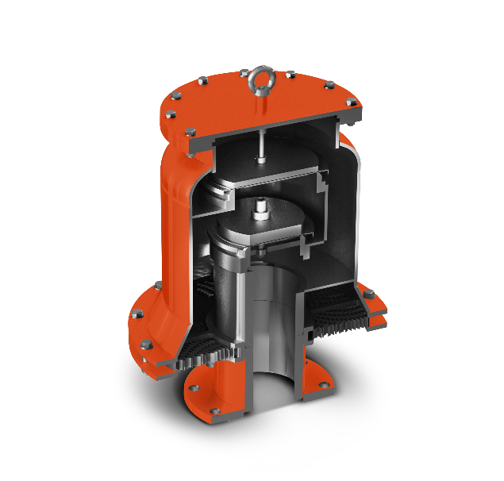
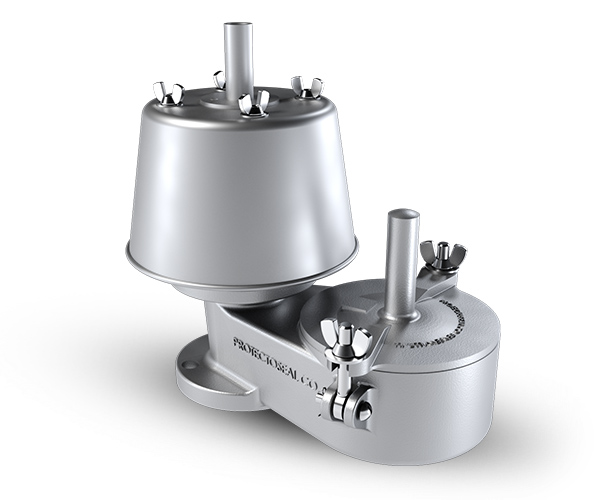

# Protectoseal Conservation Vents

**Brand:** Protectoseal  
**Category:** Safety Equipment / Vapor Control / Pressure & Vacuum Relief Vents  
**SKU:** PS-CONS-VENT  
**Status:** Build-to-Order / ATEX & API 2000 Compliant

---

## Short Description
**Protectoseal Conservation Vents** (Pressure / Vacuum Relief Vents) are engineered to minimize evaporation losses of valuable storage tank contents to the atmosphere while protecting the vessel from structural damage due to overpressure or vacuum. These vents are factory-set to open at precise pressure and vacuum levels, automatically resealing to maintain tank vapors within safe operating limits.

- **Primary Models:** Series 8540G/H (End-of-Line), Series 18540 (Pipe-Away), and Series 830 (with integrated Flame Arrester).
- **Size Range:** DN 50 to DN 300 (2" to 12").
- **Low Leakage Rate:** Certified leakage of no more than 1 SCFH of air at 90% of the set point.
- **Seating Design:** Air-cushioned seating with FEP diaphragms for tight seals.

---

## Product Gallery
  

---

## Detailed Description

### Overview
In liquid storage tanks, daily temperature fluctuations cause vapor expansion and contraction (thermal breathing), while filling and emptying operations cause pressure changes. **Protectoseal Conservation Vents** act as breathing valves, allowing the tank to release excess pressure during thermal expansion or product filling, and admit air during vacuum conditions (product emptying or thermal contraction). By keeping the tank sealed until the set pressure or vacuum limit is reached, they reduce product loss and prevent air ingress under normal conditions.

### Operating Principle
The pallet assemblies inside the vent housing are weight-loaded or spring-loaded to match the tank's maximum allowable working pressure (MAWP) and vacuum. 
*   **Under Normal Conditions:** The pallets remain closed, containing vapors inside the tank.
*   **Overpressure:** When tank pressure exceeds the pallet weight force, the pressure pallet lifts, letting vapors escape.
*   **Vacuum:** When vacuum exceeds the setting, the vacuum pallet lifts, allowing atmospheric air into the tank to equalize pressure.
*   **Resealing:** Once pressure or vacuum is relieved, the pallets automatically return to their seats, restoring tight closure.

### Design Features
- **Air-Cushioned Seating:** Features FEP film diaphragms resting on precision-machined seats, which provides a tight seal and prevents sticking due to resinous or viscous product buildup.
- **Automatic Drainage:** The housing is designed with self-draining channels to redirect condensate away from the seating areas, preventing freezing or clogging in cold weather.
- **Easy Maintenance:** Swing-bolt construction permits easy removal of the weatherhood or covers for rapid inspection and cleaning of the pallets.

---

## Key Features & Benefits
*   **Vapor Retention:** Drastically reduces volatile organic compound (VOC) emissions, protecting the environment and saving product.
*   **Corrosion Resistance:** Available in a wide selection of wetted materials, including Aluminum, Ductile Iron, Carbon Steel, 316 Stainless Steel, and Hastelloy C. Non-metallic options (FRP, Thermoplastic) are available for highly corrosive services.
*   **Replaceable Pallet Assemblies:** Pallet weights can be adjusted or added to modify settings post-installation.
*   **Industry Compliance:** Designed and tested in accordance with API 2000, ISO 28300, and NFPA 30 guidelines.

---

## Technical Specifications

### Technical Fact Sheet

| Parameter | Specification Details |
| :--- | :--- |
| **Vent Types Available** | End-of-Line (Series 8540G/H), Pipe-Away (Series 18540), In-Line (Series 8740), Integrated Flame Arrester (Series 830) |
| **Size Range** | 2" (DN 50) through 12" (DN 300) |
| **Standard Flanges** | ANSI 125#/150# RF, DIN PN 10/16 |
| **Pressure Settings (Weight Loaded)** | 0.5 to 48 oz/in² (2.15 to 206.84 mbar) |
| **Vacuum Settings (Weight Loaded)** | 0.5 to 23 oz/in² (2.15 to 99.11 mbar) |
| **Body Materials** | Aluminum, Ductile Iron, Cast Steel, 316 Stainless Steel, Hastelloy C, FRP, Thermoplastic |
| **Diaphragm Material** | FEP standard (Viton, Buna-N, EPDM, Neoprene available) |
| **Certified Tightness** | < 1 SCFH leakage at 90% of set pressure |
| **Approvals** | ATEX Directive compliant, CE marked |

---

## Applications & Use Cases
*   **Petrochemical Storage Tanks:** Installed on atmospheric storage tanks containing petroleum products, solvents, and chemicals.
*   **Refinery Tank Farms:** Used on crude oil and refined product tanks to control vapors and prevent tank deformation.
*   **Chemical Process Industries:** Protection on chemical batch reactors and storage vessels.
*   **Water Treatment Facilities:** Mounted on digestion tanks or chemical dosing tanks to release pressure and vacuum.

---

## References & Sources
1.  **Local Source:** `Protectoseal.docx` (Extracted Text: `Protectoseal_extracted.txt`)
2.  **Manufacturer Catalog:** Protectoseal Vapor & Flame Control Solutions - Series 8540G & 18540 Specification Sheets
3.  **Official Site:** [Protectoseal Official Website](https://www.protectoseal.com)
