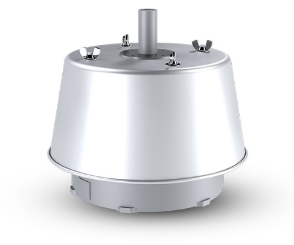
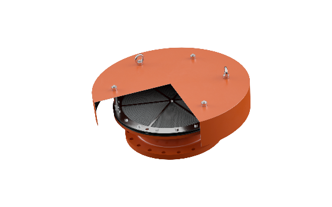

# Protectoseal Emergency Pressure Relief Vents

**Brand:** Protectoseal  
**Category:** Safety Equipment / Vapor Control / Emergency Relief Vents  
**SKU:** PS-EMERG-VENT  
**Status:** Build-to-Order / NFPA 30 & API 2000 Compliant

---

## Short Description
**Protectoseal Emergency Pressure Relief Vents** are designed to provide high-capacity overpressure relief for above-ground storage tanks when exposed to abnormal conditions such as external fire. These vents act as secondary safety devices, preventing catastrophic tank rupture when standard conservation vents or flame arresters cannot handle the excessive vapor volume generated by extreme heat.

- **Primary Models:** Series 7800 (End-of-Line), Series 51600 (Hinged Manhole), Series 52600 (Pressure & Vacuum Manhole), and Series 53300 (Manual Reset).
- **Size Range:** DN 50 to DN 600 (2" to 24") for nozzles, and up to 24" for manhole covers.
- **Standards:** Sized and certified in accordance with NFPA 30 Flammable and Combustible Liquids Code and API 2000.
- **Relief Options:** Available as pressure relief only, or combined pressure and vacuum relief.

---

## Product Gallery
  

---

## Detailed Description

### Overview
During an exposure fire near a flammable liquid storage tank, rapid heat transfer to the tank contents causes rapid boiling and vaporization. For petroleum-based products, this can produce roughly 30 or more cubic feet of vapor for every gallon of liquid vaporized. Normal operating vents are sized for standard pumping rates and thermal breathing, making them insufficient for such high volumes. Without sufficient emergency relief, pressure inside the tank can cause catastrophic structural failure or rupture. **Protectoseal Emergency Vents** offer the high discharge capacity required to safely vent these abnormal vapor volumes.

### Operating Principle
*   **Weighted Pallet Design:** Under normal operating conditions, the heavy pallet assembly remains tightly closed against the seat, preventing any vapor leakage.
*   **Emergency Activation:** When an external fire heats the tank and pressure rises to a predetermined set point, the force of the internal vapor pressure overcomes the weight of the pallet, lifting it to allow the rapid escape of vapors.
*   **Automatic Resetting:** For models like the Series 7800, 51600, and 52600, the pallet automatically reseals once the tank pressure drops back below the set point, protecting the tank contents from air exposure.
*   **Manual Resetting (Series 53300):** In applications where operators must inspect the tank after an emergency venting event, manual reset models remain open until manually closed.

### Key Design Benefits
- **Tank Access (Manhole Designs):** The manhole cover series (51600, 52600) serve a dual purpose, acting as emergency vents and providing convenient access for tank entry and cleaning.
- **Low Leakage Sealing:** Patented "Air-Cushioned Seating" (utilizing FEP diaphragms) ensures an extremely tight seal prior to venting, keeping emissions well below standard environmental limits.
- **Corrosion Resistance:** Available in Aluminum, Carbon Steel, Stainless Steel, and Alloy C housings to withstand harsh corrosive environments and marine atmospheres.

---

## Key Features & Benefits
*   **High-Volume Flow Capacity:** Streamlined aerodynamic flow paths allow maximum discharge rates under emergency conditions.
*   **Automatic or Manual Reset:** Selectable reset behaviors depending on operation and safety requirements.
*   **Dual Pressure & Vacuum Protection:** Models like the Series 52600 incorporate a spring-loaded vacuum valve in the center of the pressure pallet, providing space-saving dual protection on a single flange.
*   **ATEX Certification:** Approved under European safety standards for explosive environments.

---

## Technical Specifications

### Technical Fact Sheet

| Parameter | Specification Details |
| :--- | :--- |
| **Model Types** | End-of-Line (Series 7800), Hinged Manhole (Series 51600 / 51700), Dual Pressure & Vacuum Manhole (Series 52600), Manual Reset (Series 53300), Spring-Loaded (Series 54000) |
| **Flange Size Range** | 2" to 24" (DN 50 to DN 600) |
| **Manhole Nominal Diameter** | 16", 20", 24" (DN 400, DN 500, DN 600) |
| **Mounting Connections** | Mates with standard ANSI 150#, API, or DIN PN 10/16 flanges |
| **Pressure Settings (Weight Loaded)** | Typically 1.0 oz/in² to 1.5 psi (depending on size and model) |
| **Vacuum Settings (Series 52600 only)** | 0.5 oz/in² (2.15 mbar) standard |
| **Body & Cover Materials** | Aluminum, Carbon Steel, 316 Stainless Steel, Hastelloy C |
| **Diaphragm Material** | FEP standard (Viton, Buna-N, EPDM available) |
| **Industry Standards** | NFPA 30, API 2000, OSHA 1910.106 |

---

## Applications & Use Cases
*   **Flammable Liquid Storage:** Installed on large bulk storage tanks holding petroleum, fuels, alcohols, and volatile chemicals.
*   **Chemical Processing Plants:** Used on process vessels and reactors that could experience runaway thermal expansion.
*   **Terminal Storage Facilities:** High-capacity venting protection at marine, rail, and truck loading terminals.

---

## References & Sources
1.  **Local Source:** `Protectoseal.docx` (Extracted Text: `Protectoseal_extracted.txt`)
2.  **Manufacturer Catalog:** Protectoseal Emergency Venting Solutions - Series 7800, 51600 & 52600 Datasheets
3.  **Official Site:** [Protectoseal Official Website](https://www.protectoseal.com)
