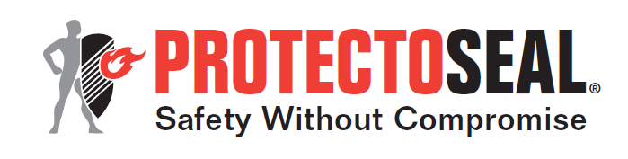
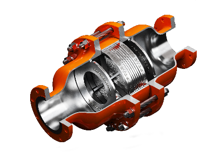

# Protectoseal In-Line Detonation Flame Arresters

**Brand:** Protectoseal  
**Category:** Safety Equipment / Vapor Control / Flame Arresters  
**SKU:** PS-IL-DFA  
**Status:** Build-to-Order / NFPA Compliant

---

## Short Description
**Protectoseal In-Line Detonation Flame Arresters** are high-performance safety devices designed to stop deflagrations, unstable detonations, and stable detonations in vapor piping systems. Engineered for closed piping runs wetted with bends and direction changes, these arresters utilize advanced metal ribbon matrices to dissipate heat and absorb shockwaves, preventing catastrophic explosions from spreading back into storage tanks or process reactors.

- **Detonation Classes:** Certified to stop deflagration, unstable detonation, and stable detonation flame fronts.
- **Vapor Control Design:** Low pressure drop across the ribbon grid optimizes vapor flow rates.
- **Safety Standard:** Extensively tested for bi-directional containment.
- **Maintenance:** Cleanable, replaceable stainless steel crimped metal ribbon elements.

---

## Product Gallery
  

---

## Detailed Description

### Overview
In industrial vapor recovery units (VRU) and storage tank vapor lines, a small ignition can quickly accelerate due to pipe friction, bends, and turbulence. This transition occurs from a deflagration (subsonic) to an unstable detonation (transonic with high pressure spikes) and finally a stable detonation (supersonic). **Protectoseal Unstable Detonation Flame Arresters** are engineered to withstand these supersonic forces and quench the flame front at any stage of acceleration.

### Operating Principle
When a flame front enters the flame arrester, the pressure wave is partially absorbed by the shock-resistant casing. The flame then enters the crimped metal ribbon matrix, which breaks the gas flow into thousands of tiny streams. The large surface area of the metal ribbon rapidly absorbs the heat of the flame, dropping the temperature of the gas below its auto-ignition point, thereby quenching the fire.

### Design Advantages
- **Unstable Detonation Rating:** Traditional flame arresters only stop deflagrations or stable detonations. Protectoseal provides complete protection, including the highly destructive *unstable detonation* phase where pressure spikes are highest.
- **Low Pressure Drop:** Maximizes flow capacity in vapor recovery and vent lines, preventing system back-pressure.
- **Bi-Directional Protection:** Stops flame fronts propagating from either direction.

---

## Key Features & Benefits
*   **Dual Function Design:** Acts as a mechanical shock absorber and a thermal heat sink.
*   **Corrosion-Resistant Element:** Crimped metal ribbon elements are manufactured from 316 Stainless Steel (Hastelloy and exotic alloys available).
*   **Temperature Ports:** Includes standard ports for temperature probes to monitor for continuous burning on the element face.
*   **Easy Element Inspection:** Bolted split-body design allows for rapid element slide-out for cleaning and inspection.

---

## Technical Specifications

### Technical Fact Sheet
Below is the technical specification table for Protectoseal's In-Line Detonation Flame Arrester line:

| Parameter | Specification Details |
| :--- | :--- |
| **Arrester Type** | In-line, bi-directional, unstable detonation flame arrester |
| **Size Range** | DN 50 to DN 600 (2" to 24") |
| **Standard Flanges** | ANSI 150# RF, DIN PN 10/16 |
| **Housing Materials** | Carbon Steel, 316 Stainless Steel, Hastelloy |
| **Element Materials** | 316 Stainless Steel standard, Hastelloy C |
| **Gas Group Compatibility**| NEC Group D (IEC IIA), NEC Group C (IEC IIB3) |
| **Max Operating Temp** | Standard up to 60°C (higher with custom ratings) |
| **Pressure Port Options** | Standard 1/4" NPT instrument ports wetted for DP gauges |

---

## Applications & Use Cases
*   **Vapor Recovery Systems:** Protection on vapor recovery lines between storage tanks and VRUs.
*   **Marine Loading Terminals:** Safety isolation on vapor headers during ship-to-shore loading.
*   **Combustion & Flare Lines:** In-line safety barriers upstream of thermal oxidizers, incinerators, and flare stacks.
*   **Sewage Digester Gas:** Protection on biogas recovery piping in municipal water plants.

---

## References & Sources
1.  **Local Source:** `Protectoseal.docx` (Extracted Text: `Protectoseal_extracted.txt`)
2.  **Manufacturer Catalog:** Protectoseal Vapor & Flame Control Solutions - Detonation Flame Arresters Brochure
3.  **Official Site:** [Protectoseal Official Website](https://www.protectoseal.com)
