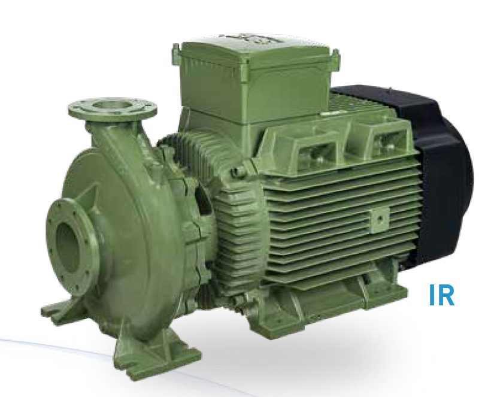
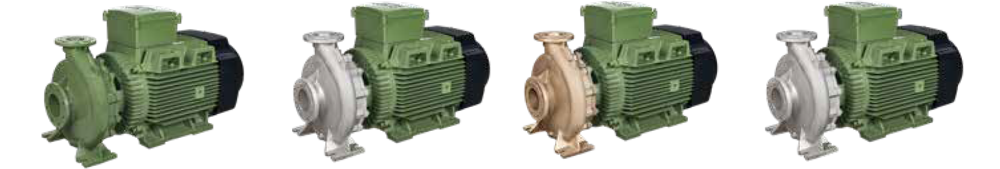

# SAER IR-Series Close-Coupled End-Suction Centrifugal Pumps

**Brand:** SAER Elettropompe  
**Category:** Pumps / Industrial Pumps / End-Suction Pumps  
**SKU:** SAER-IR-SERIES  
**Status:** In Stock / Made in Italy

---

## Short Description
**SAER IR-Series End-Suction Close-Coupled Centrifugal Pumps** are highly reliable, EN 733-compliant pumps designed for a wide range of water transport applications. With newly expanded 2-pole and 4-pole motor models offering powers up to 90 kW, these close-coupled pumps deliver exceptional hydraulic efficiency and a compact footprint. Available in multiple metallurgy configurations including cast iron, bronze, stainless steel, and super duplex.

- **Power Range:** 0.37 kW to 90 kW.
- **Design Standard:** Fully compliant with EN 733 dimensions and hydraulic performance.
- **Flow Rate (Q):** Up to 825 m³/h.
- **Maximum Head (H):** Up to 129 m.
- **Wetted Materials:** Cast Iron, Bronze, Stainless Steel (AISI 316), and Super Duplex.

---

## Product Gallery
  

---

## Detailed Description

### Overview
The **SAER IR-Series** close-coupled centrifugal pumps combine the standardization benefits of the European EN 733 standard with the space-saving advantages of a monobloc design. By close-coupling the motor directly to the pump casing, SAER eliminates the need for baseplates, flexible couplings, and precise shaft alignment during installation. This makes the IR series an ideal and cost-effective solution for compact mechanical rooms, skid installations, and OEM systems.

### Compact Close-Coupled Construction
- **Monobloc Alignment:** The impeller is mounted directly onto the extended motor shaft or a stub shaft, guaranteeing perfect concentricity, reducing vibration, and extending the lifespan of the mechanical seals.
- **EN 733 Standards:** Back pull-out design allows the rotating elements (impeller, seal plate, and motor) to be removed for maintenance without disconnecting the pump casing from the suction and discharge pipe flanges.
- **Material Flexibility:** Capable of handling aggressive, corrosive, or brackish fluids by offering optional bronze or stainless steel construction.

### Motor and Efficiency Standards
Motors used are heavy-duty TEFC electric motors compliant with the **2009/125/EC (ErP) Directive**. High-efficiency IE3 and IE4 class motors are standard, minimizing operating energy costs.

---

## Key Features & Benefits
*   **EN 733 Standardized Dimensions:** Facilitates drop-in replacement of existing EN 733 pumps regardless of brand.
*   **Extended Power Range:** New heavy-duty models handle up to 90 kW for large-scale municipal and industrial duties.
*   **High Performance Mechanical Seal:** Standard mechanical seal complies with UNI EN 12756. Multiple carbon/ceramic/silicon carbide and elastomer options are available depending on fluid parameters.
*   **Back Pull-Out Feature:** Reduces downtime for maintenance since piping remains undisturbed.

---

## Technical Specifications

### Technical Fact Sheet

| Parameter | Specification Details |
| :--- | :--- |
| **Pump Type** | Single-stage end-suction close-coupled centrifugal pump |
| **Design Standard** | EN 733 |
| **Flow Rate (Q)** | Up to 825 m³/h |
| **Head (H)** | Up to 129 m |
| **Power Range** | 0.37 kW to 90 kW |
| **Motor Poles** | 2 poles (~2900 rpm) or 4 poles (~1450 rpm) |
| **Flanged Connections** | Inlet: DN 50 to DN 200, Outlet: DN 32 to DN 150 (PN 10/16) |
| **Liquid Temp Range** | Standard: -15°C to +120°C |
| **Max Working Pressure** | 10 bar standard (16 bar optional depending on model) |
| **Body / Casing Material** | Cast Iron, Bronze, AISI 316 Stainless Steel, Super Duplex |
| **Impeller Material** | Cast Iron, Bronze, Stainless Steel, or Super Duplex |
| **Shaft Material** | AISI 431 / AISI 316 Stainless Steel |
| **Motor Specifications** | IP55, Class F, IE3 / IE4 High-Efficiency standard |

---

## Applications & Use Cases
*   **Municipal Water Supply:** Water distribution networks, water purification plants, and pressure booster stations.
*   **Agricultural Irrigation:** High-volume sprinkler irrigation, flood irrigation, and river water extraction.
*   **Fire Fighting Systems:** High-reliability water supply pumps for sprinkler and hydrant systems.
*   **Industrial Process Water:** Transfer of cooling water, washing water, and mild process chemicals.

---

## References & Sources
1.  **Local Source:** `SAER Water Pump.docx` (Extracted Text: `SAER Water Pump_extracted.txt`)
2.  **Manufacturer Catalog:** SAER Elettropompe - Close Coupled Centrifugal Pumps Series IR (EN 733 Catalogues)
3.  **Official Site:** [SAER Elettropompe Official Website](https://www.saerelettropompe.com)
