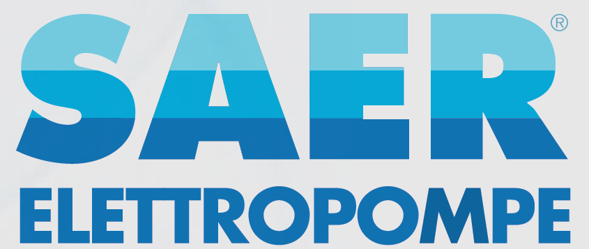
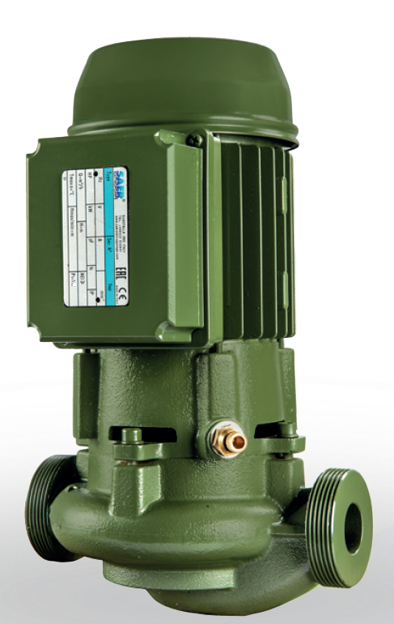

# SAER L-Series In-Line Centrifugal Pumps

**Brand:** SAER Elettropompe  
**Category:** Pumps / Industrial Pumps / In-Line Pumps  
**SKU:** SAER-L-SERIES  
**Status:** In Stock / Made in Italy

---

## Short Description
**SAER L-Series In-Line Centrifugal Pumps** are high-efficiency, single-stage pumps featuring a compact, space-saving design. Engineered specifically for HVAC, water supply, and heating/cooling systems, the L-series offers exceptional reliability and quiet operation. Constructed using high-grade materials like nodular cast iron, bronze, and stainless steel, these pumps ensure constant hydraulic performance under demanding environments.

- **Power Range:** 0.18 kW to 92 kW (2-pole and 4-pole motor options).
- **Connections:** DN 25 to DN 150 suction & outlet diameters.
- **Flow Rate (Q):** 0.5 m³/h to 800 m³/h.
- **Maximum Head (H):** Up to 102 m.
- **Manufactured:** 100% in Italy.

---

## Product Gallery
  

---

## Detailed Description

### Overview
In building services, industrial water distribution, and climate control (HVAC) systems, maximizing usable space is a top priority. The **SAER L-Series** solves this by aligning the inlet and outlet ports along a single axis (in-line configuration). This design allows the pump to be mounted directly in the pipeline, eliminating the complex piping configurations and large footprints associated with traditional end-suction pumps.

### Construction & Material Excellence
SAER uses advanced manufacturing and high-grade materials to prolong service life:
*   **Housing:** Special nodular cast iron standard for high structural stability and resistance to deformation under thermal expansion.
*   **Impeller:** Balanced cast iron, bronze, or AISI 316 stainless steel to reduce vibration and prevent cavitation wear.
*   **Shaft:** Heavy-duty stainless steel wetted with high-performance mechanical seals to prevent leakage.
*   **Configuration:** Monobloc (close-coupled) construction up to DN 65, and rigid coupling with standardized flanged motors for DN 80 sizes and above.

### Efficiency and Control
All pumps and motors in this range conform to the **2009/125/EC Directive (ErP)**. For variable demand systems, the L-series can be equipped with motor-mounted inverters (L-IVE version) to automatically adjust pump speed, lowering energy consumption and extending seal life.

---

## Key Features & Benefits
*   **In-Line Layout:** Simplifies installation, saves piping fittings, and reduces footprint in mechanical rooms.
*   **Low Noise Operation:** Precision rotor balancing and optimized casing hydraulics lead to extremely quiet running, ideal for residential and commercial HVAC applications.
*   **High Temperature Tolerance:** Standard design handles liquids from -15°C to +120°C, with optional high-temperature configurations up to +140°C.
*   **Robust Shaft Seal:** Standard mechanical seal complies with EN 12756, available in various material pairings (silicon carbide, tungsten carbide, EPDM, Viton) to match pumped fluid chemistry.

---

## Technical Specifications

### Technical Fact Sheet

| Parameter | Specification Details |
| :--- | :--- |
| **Pump Type** | Single-stage in-line centrifugal pump |
| **Flow Rate (Q)** | 0.5 to 800 m³/h |
| **Head (H)** | Up to 102 m |
| **Power Range** | 0.18 kW to 92 kW |
| **Motor Speed** | ~2900 rpm (2 poles) or ~1450 rpm (4 poles) |
| **Inlet / Outlet Size** | DN 25 to DN 150 (PN 16 flanged) |
| **Liquid Temp Range** | Standard: -15°C to +120°C (up to +140°C on request) |
| **Max Working Pressure** | 16 bar |
| **Body / Casing Material** | Nodular Cast Iron GGG40 / GGG50, Bronze, AISI 316 Stainless Steel |
| **Impeller Material** | Cast Iron, Bronze, or Stainless Steel (AISI 316) |
| **Shaft Material** | Stainless Steel (AISI 431 or AISI 316) |
| **Motor Standards** | TEFC, Class F insulation, IP55 protection (IE3/IE4 efficiency) |

---

## Applications & Use Cases
*   **HVAC Systems:** Circulation of hot water for heating and chilled water for air conditioning systems.
*   **Civil & Industrial Water Supply:** Pressure boosting, irrigation, and bulk transfer in commercial buildings and plants.
*   **Industrial Cooling Circuits:** Coolant circulation in processing plants.
*   **Booster Sets:** Integrated as duty/standby pumps in large domestic water booster packages.

---

## References & Sources
1.  **Local Source:** `SAER Water Pump.docx` (Extracted Text: `SAER Water Pump_extracted.txt`)
2.  **Manufacturer Catalog:** SAER Elettropompe - In-Line Pumps Series L (50Hz / 60Hz Catalogues)
3.  **Official Site:** [SAER Elettropompe Official Website](https://www.saerelettropompe.com)
