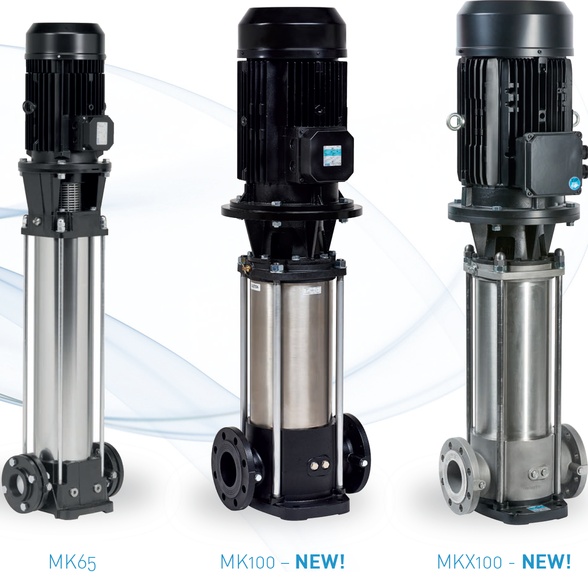
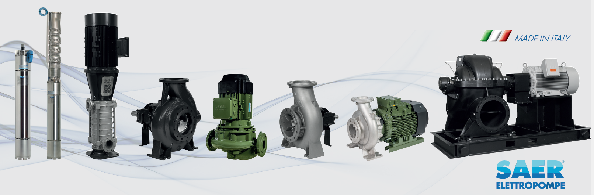

# SAER MKM-Series Vertical Multistage Centrifugal Pumps

**Brand:** SAER Elettropompe  
**Category:** Pumps / Industrial Pumps / Vertical Multistage Pumps  
**SKU:** SAER-MKM-SERIES  
**Status:** In Stock / Made in Italy

---

## Short Description
**SAER MKM-Series Vertical Multistage Pumps** are non-self-priming, close-coupled vertical centrifugal pumps designed for high-pressure applications where space is limited. Featuring an innovative compact design and robust construction, these pumps are ideal for pressure booster sets, agricultural irrigation, water purification systems, and HVAC duties. Designed in compliance with the ErP 2009/125/EC Directive, they deliver exceptional pressure heads and reliable operation.

- **Power Range:** 0.75 kW to 4 kW (Close-coupled MKM series; broader MK range extends to 55 kW).
- **Models:** 37 distinct models divided across 4 product series.
- **Maximum Head:** 123.5 m (up to 136.5 m at zero flow/shut-off).
- **Maximum Flow Rate (Q):** Up to 13 m³/h (broader MK range extends to 110 m³/h).
- **Maximum Working Pressure:** 25 bar.

---

## Product Gallery
  

---

## Detailed Description

### Overview
When high pressure is required but installation space is highly constrained, horizontal multistage pumps are often too long. The **SAER MKM-Series** addresses this by employing a vertical close-coupled design that minimizes footprint. By stacking multiple impellers and diffusers vertically, the MKM series builds pressure incrementally, stage by stage, while keeping the pump's horizontal footprint to an absolute minimum.

### Engineering & Construction Features
- **Integrated Bearings:** The pump shaft is supported by an independent heavy-duty bearing housing designed to absorb all axial hydraulic thrust. This allows the pump to use standard, off-the-shelf electric motors rather than custom high-thrust motors.
- **ErP Directive Conformity:** Both the pump hydraulics and motors are fully compliant with the European **ErP 2009/125/EC Directive**, ensuring optimal energy efficiency.
- **Hydraulics & Seals:** Impellers and diffusers are engineered for quiet operation and low energy consumption. The mechanical shaft seal complies with the UNI EN 12756 standard.
- **Direction of Rotation:** Counterclockwise rotation, viewed when facing the motor from the top.

---

## Key Features & Benefits
*   **Minimum Footprint:** Vertical configuration is perfect for space-restricted lifting stations and compact autoclave booster skids.
*   **High Working Pressure:** Rated for up to 25 bar maximum working pressure (sum of suction pressure and shut-off head), making it suitable for high-elevation buildings and long-distance irrigation.
*   **Robust Materials:** Wet-end components are available in high-strength cast iron or stainless steel options.
*   **Wide Temperature Range:** Standard liquid temperature range is -15°C to +90°C, with high-temperature options available up to +120°C upon request.

---

## Technical Specifications

### Technical Fact Sheet (MKM Sub-Series)
This table details the specific close-coupled MKM sub-series featured in our core technical documentation:

| Parameter | Specification Details |
| :--- | :--- |
| **Pump Type** | Vertical close-coupled multistage centrifugal pump |
| **Number of Models** | 37 models divided into 4 series |
| **Power Range** | 0.75 kW to 4.0 kW |
| **Operating Speed** | ~2900 rpm (2 poles) |
| **Flow Rate Range (Q)** | Up to 13 m³/h (max efficiency point) |
| **Max Head (H)** | 123.5 m (Shut-off / Q=0 Head: 136.5 m) |
| **Max Working Pressure** | 25 bar |
| **Liquid Temp Range** | Standard: -15°C to +90°C (up to +120°C on request) |
| **Rotation Direction** | Counterclockwise (facing the motor) |
| **Compliance** | ErP 2009/125/EC Directive |
| **Mechanical Seal** | Standard UNI EN 12756 |

### Broad MK-Series Family Limits (Extended Range)
For heavy-duty municipal and industrial duties, the parent MK-Series family can be configured with the following limits:
- **Max Flow:** Up to 110 m³/h
- **Max Head:** Up to 394 m
- **Max Power:** Up to 55 kW

---

## Applications & Use Cases
*   **Water Booster Sets:** Residential and commercial pressure boosting systems with or without autoclaves.
*   **Agricultural Irrigation:** Sprinkler systems, drip systems, and high-pressure hose reels.
*   **Boiler Feed Systems:** Feeding high-pressure steam boiler systems.
*   **Water Purification:** High-pressure reverse osmosis and water filtration feed.

---

## References & Sources
1.  **Local Source:** `SAER Water Pump.docx` (Extracted Text: `SAER Water Pump_extracted.txt`)
2.  **Manufacturer Catalog:** SAER Elettropompe - Vertical Multistage Pumps Series MK / MKM (50Hz / 60Hz Catalogues)
3.  **Official Site:** [SAER Elettropompe Official Website](https://www.saerelettropompe.com)
