# Victor Pumps S-Series Self-Priming Centrifugal Pumps

**Brand:** Victor Pumps  
**Category:** Pumps / Industrial Pumps / Self-Priming Pumps  
**SKU:** VP-S-SERIES  
**Status:** Build-to-Order / ATEX Certified Available

---

## Short Description
**Victor Pumps S-Series Self-Priming Centrifugal Pumps** are heavy-duty industrial pumps engineered to handle corrosive, abrasive, and viscous liquids containing suspended solids, gas, or air. Designed to operate from dry conditions, these pumps can self-prime up to their physical limit of 8 meters. Available in cast iron, bronze, aluminum, and stainless steel, they can be configured with multiple drive and mounting types for stationary or mobile use.

- **Maximum Flow Rate:** Up to 600 m³/h (5,300 US GPM).
- **Maximum Head:** Up to 65 m.
- **Self-Priming Lift:** Up to 8 m (physical suction limit).
- **Port Connections:** Threaded or flanged from 1-1/2" up to 12" sizes.
- **Drive Compatibility:** Electric motors (single/three-phase, explosion-proof/ATEX), gasoline/diesel engines, or hydraulic motors.

---

## Product Gallery & Mounting Configurations
The S-Series is highly versatile and available in various stationary and mobile configurations:

### Stationary Configurations
*   **Main Pump Unit:** 
*   **Close-Coupled Pump:** 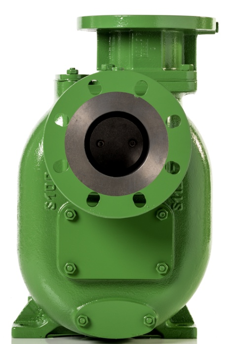
*   **Bi-Block with Flanged Ports:** 
*   **Bi-Block on Base Plate:** 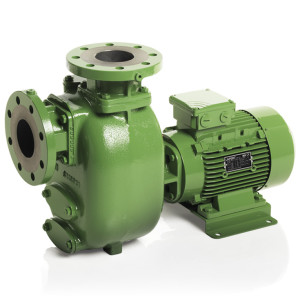
*   **Classic Coupling (with Elastic Coupling, Guard & B3 Motor on Base Plate):** 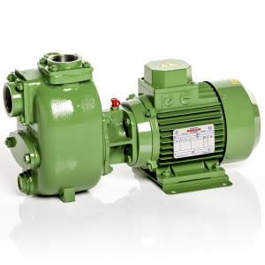
*   **With Hydraulic Motor:** 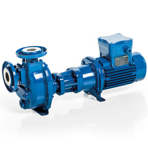
*   **On Tank Frame:** 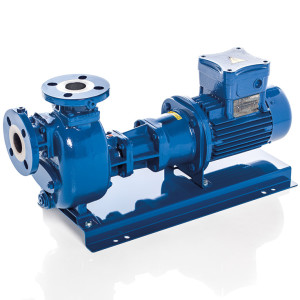

### Mobile Configurations
*   **On Carrying Frame:** 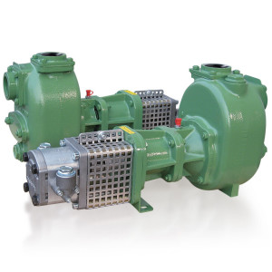
*   **On Trolley for Flat Ground:** 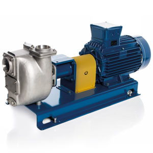
*   **On Trolley with 2 Tractor Profile Wheels:** 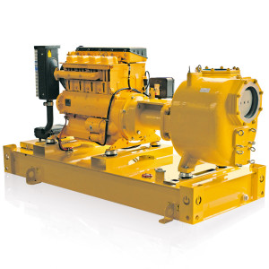
*   **On Trailer with Tank:** 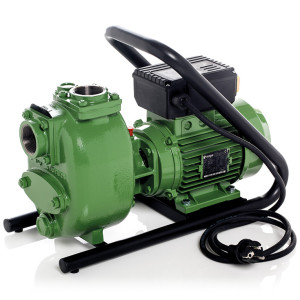
*   **On Carrying Frame for Emergency Services:** 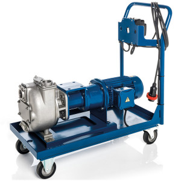
*   **On Trailer with Tank & 4 Wheels for Flat Ground:** 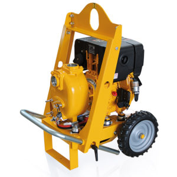
*   **On Skid Mounting:** 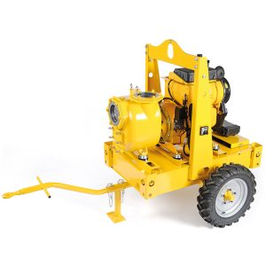

### Additional Engineering Views
*   **Wear Plate and Impeller Detail:** 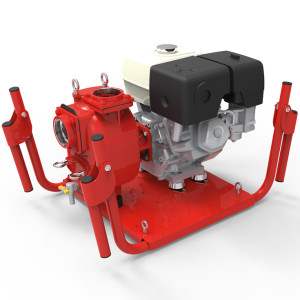
*   **Shaft Sleeve and Mechanical Seal Housing:** 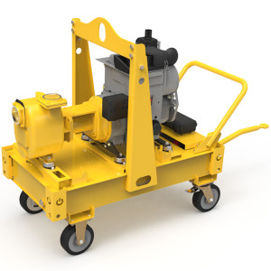
*   **Check Valve and Inlet Details:** 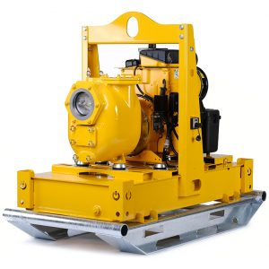

---

## Detailed Description

### Overview
Standard centrifugal pumps cannot evacuate air from the suction line and require priming before startup. The **Victor Pumps S-Series** features a dual-chamber design (priming chamber and separation chamber) that allows the pump to prime itself automatically. Once the pump casing is filled with liquid during initial installation, the pump can prime from dry suction lines, separating air from the liquid and discharging it through the outlet.

### Operating and Maintenance Design Advantages
- **Heavy-Duty Open Impeller:** The pump features an open, multi-vane impeller and an easily replaceable wear plate. This design minimizes clogging, tolerates highly abrasive materials, and allows large suspended solids to pass smoothly.
- **Integrated Check Valve:** An internal check valve at the inlet prevents siphoning and backflow when the pump is shut down, maintaining liquid in the casing and reducing subsequent priming times. Available in NBR, Viton® (FKM), PTFE, or EPDM.
- **Enhanced Dry Running:** The mechanical seal (Silicon Carbide/Viton standard) is equipped with a stainless steel shaft sleeve and a grease/oil lubrication reservoir behind the seal faces, protecting the pump from thermal shock during dry priming cycles.
- **Maintenance-Free Bearings:** Oversized ball bearings are lubricated for life, reducing overall maintenance overhead.

---

## Key Features & Benefits
*   **Rapid Self-Priming:** Up to 8 meters suction lift without requiring external priming valves or vacuum assist.
*   **Broad Metallurgy Range:** Casing and impellers are available in Cast Iron, Spheroidal Cast Iron, Bronze, Aluminum, and Stainless Steel (AISI 316) to handle highly corrosive or marine environments.
*   **Through-Hole Flanges:** DIN or ASA flanged ports include through-holes for rapid piping installation, and standard 1/4" NPT threaded taps for pressure and vacuum gauges.
*   **Threaded Ports (Up to 4"):** Threaded models include through-holes to simplify hose/pipe attachment and decoupling.
*   **ATEX Compliance:** Optional explosion-proof ratings for hazardous areas (NEC / IECEx / ATEX zones).

---

## Technical Specifications

### Technical Fact Sheet

| Parameter | Specification Details |
| :--- | :--- |
| **Pump Design** | Self-priming open-impeller centrifugal pump |
| **Flow Rate (Q)** | Up to 600 m³/h (5,300 US GPM) |
| **Head (H)** | Up to 65 m (213 ft) |
| **Self-Priming Lift** | Up to 8 m (26 ft) maximum vertical suction lift |
| **Port Connections** | Threaded (up to 4") or Flanged (DIN PN 10/16 or ASA 150#) |
| **Solid Handling Size** | Handles suspended solids depending on pump size (up to 3" / 75 mm) |
| **Standard Casing Materials** | Cast Iron, Bronze, Aluminum, AISI 316 Stainless Steel |
| **Check Valve Elastomers** | NBR, Viton® (FKM), PTFE, EPDM |
| **Mechanical Seal Materials**| Silicon Carbide (SiC) / Viton® / Stainless Steel (optional exotic pairs) |
| **Bearings** | Maintenance-free, grease-lubricated ball bearings |
| **Drive Types** | Electric Motors, Petrol Engines, Diesel Engines, Hydraulic Motors |

---

## Applications & Use Cases
*   **Industrial Wastewater Treatment:** Pumping grit, sludge, neutral or acidic effluent, and process water.
*   **Emergency Dewatering:** Mobile trailer-mounted units used by municipal emergency services to pump floodwaters containing mud and debris.
*   **Construction Sites:** Excavation drainage, trench dewatering, and general site drainage.
*   **Marine & Shipbuilding:** Bilge pumping, ballast transfer, and deck wash services (utilizing bronze or aluminum metallurgy).
*   **Agriculture:** Liquid manure handling, ditch dewatering, and river water extraction for irrigation.

---

## References & Sources
1.  **Local Source:** `Victor Pumpen.docx` (Extracted Text: `Victor Pumpen_extracted.txt`)
2.  **Manufacturer Catalog:** Victor Pumpen S-Series Self-Priming Centrifugal Pumps Technical Brochure
3.  **Official Site:** [Victor Pumps Official Website](https://www.victorpumps.com)
